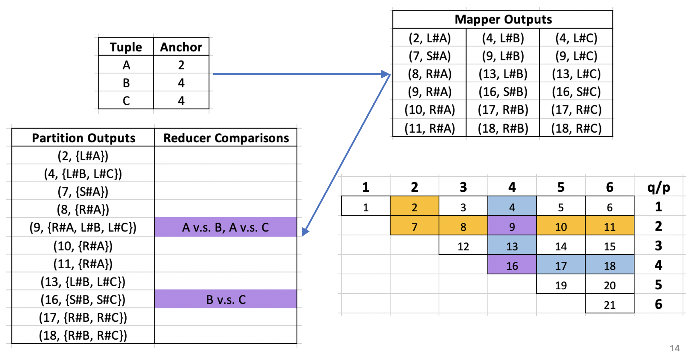
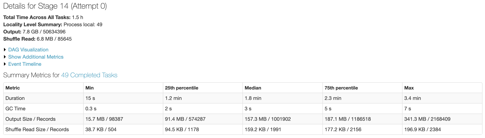
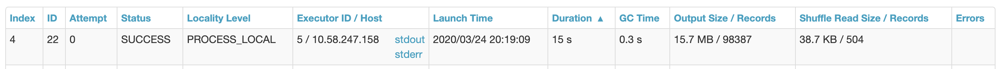
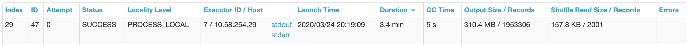

# SparklyClean

Scala-based, Spark implementation of [Distributed Data Deduplication](http://www.vldb.org/pvldb/vol9/p864-chu.pdf) that guarantees optimal data distribution in distributed data deduplication tasks.

This repo can be used as a starting point for any distributed data deduplication task.

---

### Contents

1. [Overview](https://github.com/david-siqi-liu/sparklyclean#1-overview)
2. [DisDedup](https://github.com/david-siqi-liu/sparklyclean#2-disdedup)
3. [Improvements](https://github.com/david-siqi-liu/sparklyclean#3-improvements)
4. [Project Organization](https://github.com/david-siqi-liu/sparklyclean#4-project-organization)
5. [How To Use](https://github.com/david-siqi-liu/sparklyclean#5-how-to-use)
7. [Example](https://github.com/david-siqi-liu/sparklyclean#6-example)
7. [Future Work](https://github.com/david-siqi-liu/sparklyclean#7-future-work)

---

### 1. Overview

**Data deduplication** is the process of identifying tuples in a dataset that refer to the same real world entity. It is very costly to be ran on a single machine - for a dataset with  tuples, this is a  operation since each tuple needs to be compared with every other tuple in the dataset.

A commonly used technique to avoid this quadratic complexity is **blocking**. Basically, blocking functions partition the dataset into disjoint blocks, and only tuples within the same blocks are compared. For example, suppose we possess some domain-knowledge, and introduces a blocking function (e.g., account type) that partitions the dataset into two equally-large blocks of size , then the total number of pair-wise comparisons becomes , half of the original. Unfortunately, this may introduce many false-negatives (e.g., when account type is null), so in practice, multiple blocking functions are used together.

With the help of **distributed systems** such as Hadoop MapReduce and Spark, we can parallelize this intensivie data deduplication task. Several challenges need to be addressed:

1. In addition to **computation cost** that exists in the traditional, centralized setting, distributed algorithms also incur **communication cost**, which essentially is the network transfer and I/O cost for sending, receiving and storing data from each worker
2. It is typical to have **data skew** in a distributed task. Ideally, we want all workers to perform roughly the same amount of work so we don't encounter a "bottleneck" issue
3. The distribution strategy should be able to handle multiple blocking functions. Specifically, we need to ensure that each tuple pair is compared exactly once, not multiple times if they exists in the same block according to multiple blocking functions

---

### 2. DisDedup

*DisDedup* is the distributed framework proposed by the paper. It aims to minimize the maximum cost (both computation and communication) across all workers in the network.

At a very high level, the framework does the following:

1. In the **setup** phase, compute the amount of work (i.e., number of pair-wise comparisons) within each block, produced by each blocking function. Then, assign workers to each block based on its workload
   - Larger blocks get assigned multiple workers (multi-reducer blocks)
   - Smaller blocks each gets asssigned a single worker (either deterministically or randomly)
   
2. In the **map** phase, multiple-reducer blocks' workers get handled via the triangle distribution strategy

   

3. In the **partition** phase, tuples are sent to their designated worker(s)

4. In the **reduce** phase, tuples that belong to the same blocks (within each worker) are compared against one another

   - For each tuple pair, similarity scores (e.g., edit-distance) are computed for each column

5. Similarity features are outputted for further analysis (e.g., train machine learning algorithms)

Please refer to the original paper for details and proofs on optimality.

---

### 3. Improvements

In the paper, multi-reducer block  gets assigned  number of workers during the setup phase. However, in the reduce phase, the actual number of workers used is not necessarily . In fact, it is , where  is the largest integer such that   based on the triangle distribution strategy. This means that the total number of workers that are actually used across all multi-reducer blocks (i.e., ) could be substantially smaller than the total number of workers available, leaving many workers unassigned.

For example, if , then the actual number of workers used is , leaving 2 workers unassigned.

To tackle this issue, this implementation

- Re-distribute left-over workers to each multi-reducer block, prioritizing blocks with the highest difference between  and . In the above example, suppose we have 4 (or more) left-over workers, then we can give 4 to this block, making it to use  workers instead of just 6
- When deterministically distribution single-reducer blocks in a round-robin fashion, start with the unassigned workers, instead of the first worker that are already being used by a multi-reducer block

Empirically, these changes drastically improves the load-balancing issue among the workers.

---

### 4. Project Organization

```
├── impl
│   ├── BKV                   <- Block-Key-Value class
│   ├── Compare               <- Comparison functions for creating similarity features
│   ├── DisDedupMapper        <- Mapper function
│   └── DisDedupPartitioner   <- Partitioner function
│   └── DisDedupReducer       <- Reducer function
│   └── Setup                 <- Setup function
│   └── Util                  <- Utility functions
├── GenerateLabeledPoints     <- Main class, conduct pairwise comparisons and output similarity features
├── TrainDupClassifier        <- Train a classification model on labeled dataset
├── ApplyDupClassifier        <- Apply the trained model on unlabeled dataset
```

---

### 5. How To Use

1. Install the following versions of Scala, Spark and Hadoop

   - Scala 2.11.8
   - Hadoop 3.0.3
   - Spark 2.3.1 (upgrading to 2.4.5 would not yield any problem)

2. Clone/download this repo

3. Customize the following functions

   - `Util.tokenize` - tokenize each tuple in the dataset, currently configured to be comma-delimited
   - `Util.getId` - get unique identifier for each tuple in the dataset, could be as simple as a row number
   - `Util.getLabel` - if we know the ground truth between any two tuples in the dataset, we can create supervised training data. Otherwise, it will simply return empty
   - `Util.getBKVs` - run each blocking function on the given tuple. Note that the BKV value must be a string, and the BKV key also represents the ordering of the blocking function
   - `Compare.getFeatures` - for any given tuple pair, generate similarity scores (Double) for each field. Ignore fields such as IDs, blocking numbers by outputing zero

4. Compile and run `GenerateLabeledPoints` on the dataset

   ```bash
   spark-submit --class com.davidsiqiliu.sparklyclean.GenerateLabeledPoints target/SparklyClean-1.0-SNAPSHOT.jar --input /path/to/input/file --output /path/to/output/directory --reducers 49 --header --label
   ```

   - `header` is used to indicate if there's a header line at the top or not
   - `label` is used to indicate if we know the ground truth or not so that we can create supervised  training data
   - Log contains worker distribution for each BKV

The output is in the format of 

```
tuple1_id, tuple2_id, label (if known), feature1, feature2, feature3, ...
```

We can train any type of classification model using these outputs.

1. Run `TrainDupClassifier` on labeled output

   ```bash
   spark-submit --class com.davidsiqiliu.sparklyclean.TrainDupClassifier target/SparklyClean-1.0-SNAPSHOT.jar --input /path/to/output/directory/for/labeled --model /path/to/output/directory/for/model
   ```

   - Evaluation metrics such as the confusion matrix are in the log

2. Run `ApplyDupClassifier` on unlabeled output

   ```bash
   spark-submit --class com.davidsiqiliu.sparklyclean.ApplyDupClassifier target/SparklyClean-1.0-SNAPSHOT.jar --input /path/to/output/directory/for/unlabeled --model /path/to/output/directory/for/model --output/path/to/output/directory/for/predictions
   ```

---

### 6. Example

Two synthetic datasets are generated using [Febrl - freely extensible biomedical record linkage](https://github.com/J535D165/FEBRL-fork-v0.4.2/tree/master/dsgen)

- Training: `python generate.py train.csv 10000 10000 5 2 4 poisson`
  - 20,000 records (10,000 original and 10,000 duplicates)
  - At most 5 duplicates per original
  - At most 2 modifications per field
  - At most 4 modifications per record
  - Poisson distribution for the number of duplications per original
- Testing: `python generate.py test.csv 500 500 3 4 6 zipf`
  - 1,000 records (500 original and 500 duplicates)
  - At most 3 duplicates per original
  - At most 3 modifications per field
  - At most 5 modifications per record
  - Zipf/zeta distribution

Each dataset contains 14 columns:

```
0: rec_id (String)
1: given_name (String)
2: surname (String)
3: street_number (Long)
4: address_1 (String)
5: address_2 (String)
6: suburb (String)
7: postcode (String)
8: state (String)
9: date_of_birth (Long)
10: age (Long)
11: phone_number (String)
12: soc_sec_id (Long)
13: blocking_number (Long)
```

Two blocking functions are used:

1. blocking_number (priority)
2. state

Using Databricks, with a cluster of 8, m4.2xlarge machines, I ran the `GenerateLabeledPoints` jobs using  workers in parallel

For the training set, the entire job finished in around 6 minutes. Below are the metrics for Stage 14, which is the partition and reduce phase



- The minimum duration is 15 seconds (worker #4)

  

- The maximum duration is 3.4 minutes (worker #29)

  

Looking at the log, we can see that worker #29 (reducer ID 30) got shuffled to be at the front of the reducer list, while worker #4 (reducer ID 5) is at the second-last of the reducer list:

```
Shuffled s: List(30, 16, 9, 46, 6, 7, 36, 38, 8, 29, 15, 34, 37, 11, 14, 13, 45, 3, 12, 27, 18, 43, 1, 47, 4, 32, 24, 35, 25, 2, 44, 33, 21, 31, 23, 10, 39, 48, 26, 42, 22, 28, 41, 17, 49, 40, 19, 5, 20)
```

Since multi-reducer blocks get assigned a total of 47 workers, reducer ID 5 and 20 do not any work from multi-reducer blocks:

```
# Number of workers assigned to each BKV
hmMultiKi (after optimization):
BKV(1,5) -> 1
BKV(2,) -> 3
BKV(1,7) -> 1
BKV(1,2) -> 1
BKV(1,0) -> 1
BKV(2,vic) -> 10
BKV(2,qld) -> 6
BKV(1,9) -> 1
BKV(1,8) -> 1
BKV(2,nsw) -> 15
BKV(2,wa) -> 1
BKV(1,3) -> 1
BKV(1,6) -> 1
BKV(1,4) -> 1
BKV(1,1) -> 3
```

It is important to recognize that this framework **does not guarantee equal work among workers**, as that would require going over all the tuple pairs once before! Instead, it provides a general approach to tackling this problem in the presence of multiple blocking functions.

Next, `TrainDupClassifier` was ran to train a GradientBoostedTrees model using the ML library in Spark. Results as follows:

```
Confusion Matrix ([TN, FN], [FP, TP]):
1.5180436E7  152.0   
1.0          6324.0

Feature Importance:
(14,
[1,2,3,4,6,7,9,11,12],
[0.051536772124198264,
0.04146411391570883,
0.012064633345457359,
0.06434675634173335,
0.08380486362672272,
0.010927404644812844,
0.04600359274212038,
0.12761734953665552,
0.5622345137225908])
```

Notice that the trained classifier placed the most importance on 12: soc_sec_id, , followed by 11: phone_number, and the least importance on 1: given_name.

Lastly, `ApplyDupClassifier` was ran to apply the learned classifier on the unlabeled test set.

|              | Actual: 0 | Actual: 1 |
| ------------ | --------- | --------- |
| Predicted: 0 | 128,939   | 23        |
| Predicted: 1 | 0         | 756       |

For error detection, we want to have high recall scores, and our classifier was able to obtain a 97% recall score.

---

### 7. Future Work

As stated in the paper, future work includes gathering statistics about the overlapping of blocks, so that we can merge largely overlapping blocks to further reduce the communication cost.

In addition, it could be worthwhile to extend this framework to the task of detecting functional dependencies, since both deduplication and detecting functioning dependencies require pairwise comparisons between tuples and can be parallelized in similar fasions.